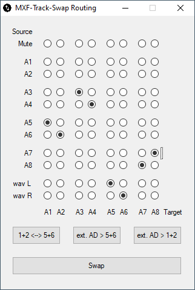
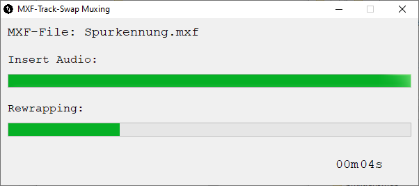

# mxf-track-swap

Provide a mxf (tested only with xdcam hd 422 op1a including 8 audio tracks) and create a new one where you can swap the audio tracks. You can provide a stereo audio file too, to embed it into the new mxf.

## Prerequisites

To build your swapper yourself you need a compiled ffmpeg that must be embedded into your swapper. Customize the following code line:

`FileInstall('K:\ffmpeg\bin\ffmpeg.exe', @TempDir & "\ffmpeg.exe", $FC_OVERWRITE)`

## Manual

Start the app and drag and drop a mxf file onto the gui. You can drag and drop an audio stereo file too.

After pushing the "Next" button you have to do your routing.

The tracks of the source are provided on the left side, the tracks of the target on the bottom. Click the radios for setting the cross points.

As we mostly use this tool for distributing audio descriptions for severeal use cases there are 3 preset buttons you can use too.

- button `1+2 <-> 5+6`: swap tracks 1 and 2 with 5 and 6
- button `ext. AD > 5+6`: embed an external audio description in tracks 5 and 6
- button `ext. AD > 1+2`: embed an external audio description in tracks 1 and 2

When you are ready with the routing push the button "Swap". A gui will show the progress of the swapping.

The new mxf file will be created in `%temp%` folder. This folder will be opened automatically. The file naming is made with this rules:

- video file name_
- 1-routed source track_
- 2-routed source track_
- 3-routed source track_
- 4-routed source track_
- 5-routed source track_
- 6-routed source track_
- 7-routed source track_
- 8-routed source track
- .mxf

The routing example in the image above would be named `Spurkennung_1-5_2-6_3-3_4-4_5-L_6-R_7-8_8-7.mxf`.

## Known issues
If you use only one track ot the external stereo wav file (e.g. "[R]") it breaks: "Filter channelsplit:FL has an unconnected outut".
